# Secure AWS VPC — Bastion Host, NACLs & Flow Logs

## Overview

Builds a production-pattern VPC from scratch: public and private subnets across two availability zones, a bastion host as the sole SSH entry point, a private EC2 instance with no direct internet access, Network ACLs layered over security groups, and VPC Flow Logs streaming to CloudWatch for traffic auditing.

## Architecture

```
Internet
    |
Internet Gateway
    |
Public Subnet AZ-A (10.0.1.0/24)     Public Subnet AZ-B (10.0.2.0/24)
    |                                       |
Bastion Host (EC2)                    (empty — reserved for HA)
    |
    | SSH tunnel through private network
    |
Private Subnet AZ-A (10.0.3.0/24)    Private Subnet AZ-B (10.0.4.0/24)
    |                                       |
Private EC2 Instance               (empty — reserved for HA)
```

- **VPC:** `secure-devops-vpc` — `10.0.0.0/16`
- **4 subnets** across 2 AZs (public + private in each) — foundation for high availability
- **Public route table** → routes `0.0.0.0/0` to the IGW
- **Private route table** → no internet route at all; this is what actually makes a subnet "private," not the name
- **Security groups:** `bastion-sg` (SSH from my IP only) → `private-ec2-sg` (SSH from `bastion-sg` only — chained, not IP-based)
- **Network ACL** on private subnets — stateless, subnet-level rules layered on top of security groups
- **VPC Flow Logs** → CloudWatch Log Group, queried via Logs Insights

## Tech Stack

- AWS VPC, EC2, IAM, CloudWatch
- SSH Agent Forwarding

## How to Access

```bash
# Load key into SSH agent
ssh-add ./my-devops-key.pem

# SSH into bastion with agent forwarding
ssh -A -i ./my-devops-key.pem ubuntu@<BASTION_PUBLIC_IP>

# From inside the bastion, hop to the private instance
ssh ubuntu@<PRIVATE_EC2_PRIVATE_IP>

# Confirm no internet access from the private instance
curl http://google.com --max-time 5
# Expected: connection timed out — proves the private route table has no IGW route
```

## Problems Faced & Fixes

**Issue:**
<br/>`ssh -A -i ~/.ssh/id_rsa ubuntu@<bastion-ip>` failed — "Permission denied (publickey)."

**Investigation:** 
<br/>SSH agent confirmed the key was loaded correctly (`ssh-add -l` showed the fingerprint). The failure was specifically at authentication, not connectivity — pointed to a key mismatch rather than a security group issue.

**Root cause:** 
<br/>The bastion's key pair (`my-devops-key`) was originally created via EC2's "Create Key Pair" flow, which generates a brand-new key pair and hands you a `.pem` download — not the same key as the existing local `~/.ssh/id_rsa`. Confirmed by comparing fingerprints:
```bash
ssh-keygen -lf my-devops-key.pem
ssh-keygen -lf ~/.ssh/id_rsa.pub
```
Fingerprints did not match.
**Fix:** Used the actual `.pem` file for authentication instead:
```bash
ssh-add ./my-devops-key.pem
ssh -A -i ./my-devops-key.pem ubuntu@<BASTION_PUBLIC_IP>
```
Succeeded immediately. `id_rsa` was left untouched, since it's still used by an existing Terraform project.

## Screenshots

### VPC overview
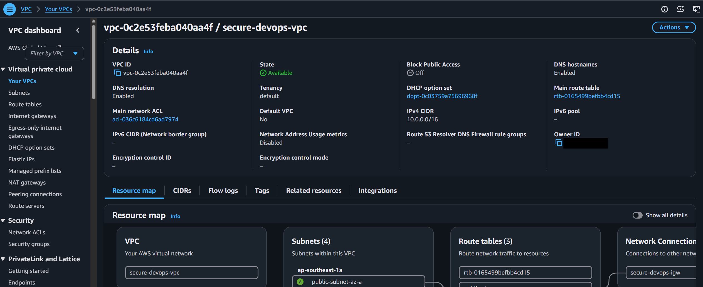

### Subnets (public + private, across 2 AZs)
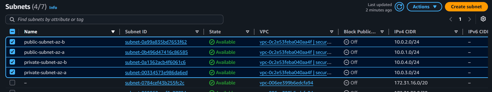

### Internet Gateway
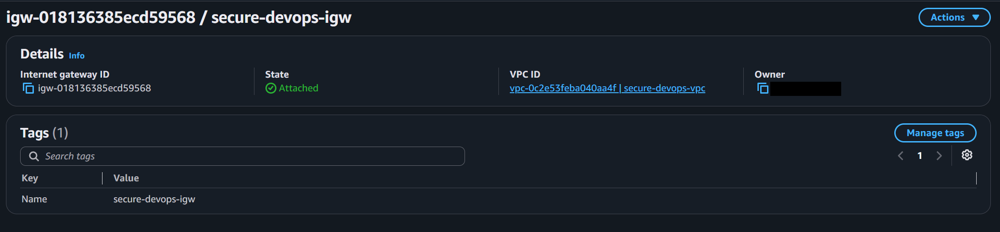

### Route tables (public + private)
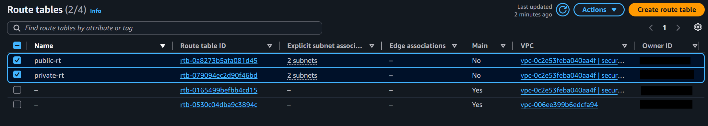

### Security groups (bastion-sg, private-ec2-sg)
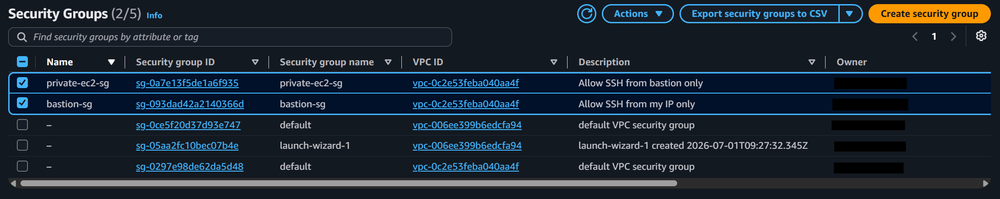

### Network ACL — inbound rules
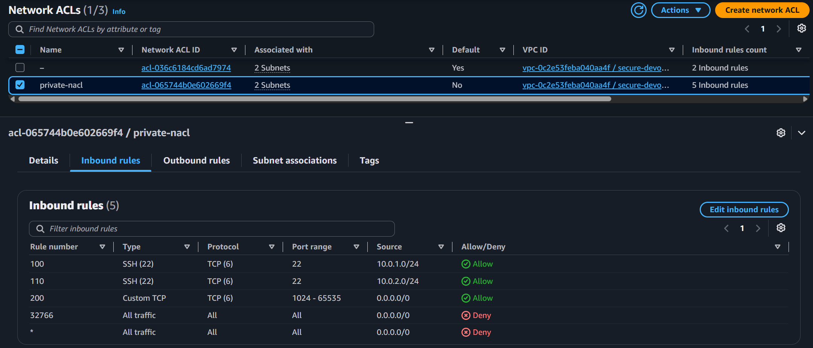

### Network ACL — outbound rules
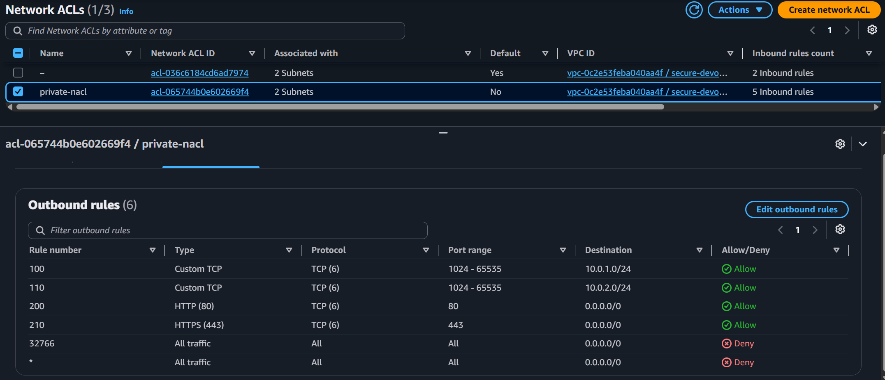

### SSH into bastion host
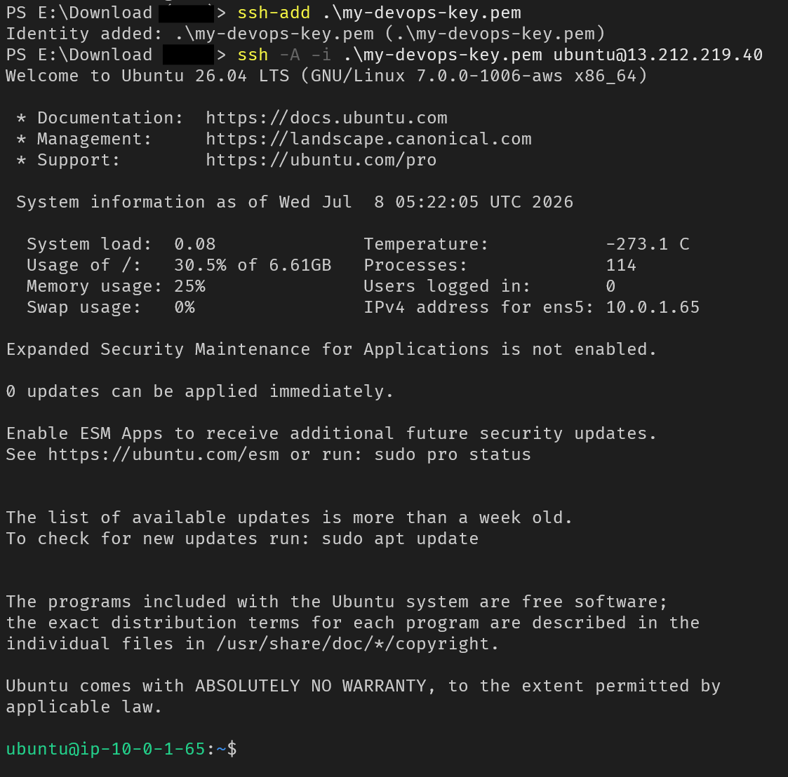

### SSH from bastion to private EC2
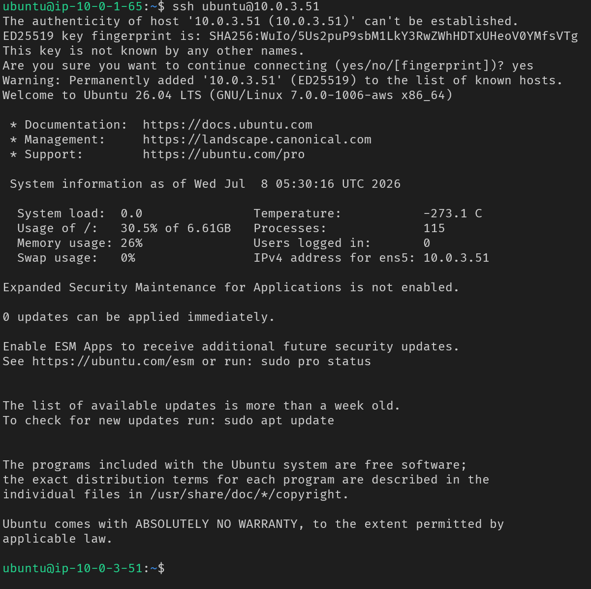

### Verified private EC2 has no internet access
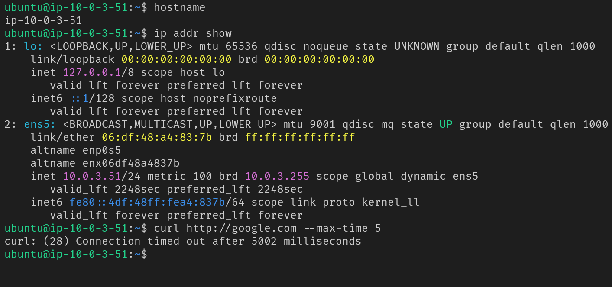

### CloudWatch Logs Insights — querying flow logs by port 22
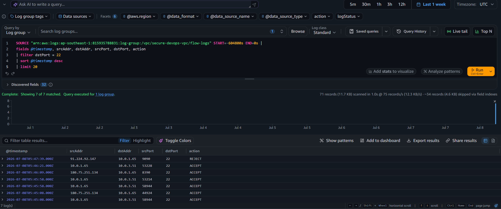

### Cleanup — flow logs deleted


### Cleanup — log group deleted


## Notes & Interesting Details

- **Why ports 1024–65535 in the NACL rules?** 
<br/>These are the *ephemeral port range* — when a client (like the bastion) opens a connection to a server, the server always replies to whatever random high-numbered port the client's OS picked for that specific connection, not to port 22. Because NACLs are **stateless** (unlike security groups), the NACL has no memory of "this reply belongs to a connection I already allowed" — it evaluates every packet independently in both directions. So an inbound rule allowing port 22 alone isn't enough; the *outbound* return traffic on that random ephemeral port must also be explicitly allowed, or the response never makes it back to the client. Security groups don't need this because they're stateful — they automatically permit return traffic for any connection they already approved.
- **Why security groups + NACLs together?** 
<br/>Two independent layers an attacker has to defeat, not one. Security groups are attached to instances and are stateful; NACLs are attached to subnets and are stateless. A misconfiguration in one doesn't automatically expose the resource if the other layer still blocks it.
- **Why chain `private-ec2-sg` to `bastion-sg` instead of an IP?** 
<br/>IP-based rules break the moment your IP changes (common with home ISPs). Referencing a security group as the source means "only traffic originating from something in this specific SG is allowed" — regardless of what IP that resource currently has. This is an AWS-specific pattern that plain IP firewalls can't replicate.
- **Why no NAT Gateway?** 
<br/>NAT Gateways cost money per hour plus data processed. The bastion host pattern achieves the same goal (controlled access into a private network) at zero cost — appropriate for a Free Tier practice project, though NAT Gateways are still common in real production setups where the private instance itself needs to reach the internet (e.g. downloading packages) without a human in the loop.
- **SSH agent forwarding (`-A` flag):** 
<br/>lets the bastion authenticate to the private instance using the key held on the *local* machine, without ever copying the private key onto the bastion itself. If the bastion were ever compromised, the private key was never there to steal.

## Cost Reminder

The only resources in this project that incur ongoing cost are the **running EC2 instances** (bastion-host, private-ec2). VPC, subnets, route tables, security groups, NACLs, IAM roles, and CloudWatch Log Groups are free to leave configured indefinitely. Stop or terminate the EC2 instances when done to avoid charges.